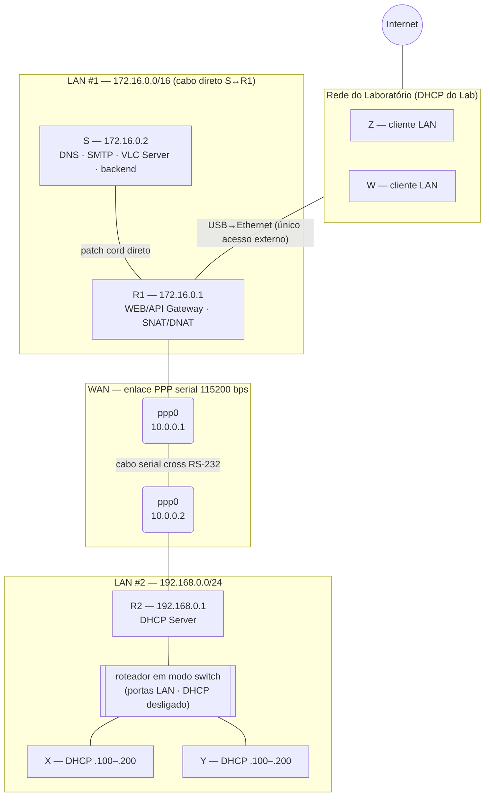
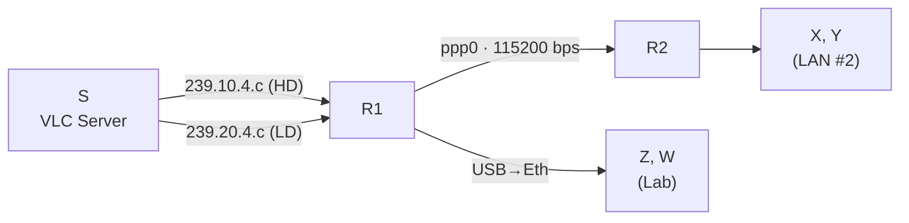

# Tutorial — Fase 1: Infraestrutura Mini-IPTV (Ubuntu 22.04, Grupo 4)

Runbook direto: siga a ordem, rode os comandos na máquina indicada, valide e siga.

## Topologia e endereços



- DNS/SMTP/VLC/backend em **S** · WEB/API Gateway/NAT em **R1** · DHCP em **R2**
- Multicast: `239.10.4.x` (LAN/Z-W) e `239.20.4.x` (WAN115K/X-Y)
- Domínio: `grupo4.unb`

**Fluxos multicast (Grupo 4):**



> **Como funciona a escolha de interface/porta:** todo bloco que depende de algo específico do PC começa com um `select`, que **lista o que existe naquela máquina e pergunta o número**:
>
> ```
> 1) enp2s0
> 2) enx00e04c001122
> #? 1          <- você digita o número e ENTER
> ```
>
> A escolha fica numa variável (`$LAN1`, `$LAB`, `$LAN2`, `$SERIAL`) usada pelos comandos seguintes **do mesmo bloco**. ⚠️ Rode o bloco inteiro **no mesmo terminal** — se abrir outro terminal, rode o `select` de novo.

## Índice por máquina

Todo comando aparece sob um subtítulo `📍 Em <máquina>` — use o outline do editor para pular direto.

| Máquina | Passos em que ela roda comandos |
|---|---|
| **S** | 0 · 2 · 5 (validar) · 8 (teste) · 10 · 11 |
| **R1** | 0 · 2 · 3 · 4 · 5 · 6 · 8 · 9 · 12 |
| **R2** | 0 · 2 · 3 · 4 · 5 · 7 · 8 |
| **X / Y** | 0 · 7 (validar) · 8 (teste) · 11 (Thunderbird) · 13 |

---

## 0. Instalar pacotes — 📍 cada bloco na máquina indicada no comentário

### 📍 Em TODAS as máquinas
```bash
sudo apt update
```

### 📍 Em S
```bash
sudo apt install -y bind9 bind9utils dnsutils postfix dovecot-imapd mailutils iperf
```
> Na tela do postfix: escolha **"Internet Site"**, mail name: `grupo4.unb`.

### 📍 Em R1
```bash
sudo apt install -y ppp smcroute apache2 iptables iptables-persistent isc-dhcp-client
```

### 📍 Em R2
```bash
sudo apt install -y ppp smcroute isc-dhcp-server
```

### 📍 Em X e Y
```bash
sudo apt install -y vlc thunderbird iperf
```

---

## 1. Cabeamento — 📍 físico (todas as máquinas)

Material do grupo: **7 PCs + 1 roteador doméstico** (usado só como switch) + adaptadores USB→Eth + cabo serial cross.

| PC | Papel | Conexão |
|---|---|---|
| PC1 | S | cabo Ethernet **direto** até R1 (LAN#1 tem só 2 hosts — dispensa switch; auto-MDIX resolve) |
| PC2 | R1 | Eth nativa ↔ S · adaptador USB→Eth ↔ rede do Lab · serial ↔ R2 |
| PC3 | R2 | Eth ↔ porta LAN do roteador · serial ↔ R1 |
| PC4/PC5 | X, Y | Eth ↔ portas LAN do roteador |
| PC6/PC7 | Z, W | Eth ↔ rede do Lab |
| Roteador | switch da LAN#2 | **só portas LAN** (WAN vazia) e **DHCP desligado** |

1. **Antes de montar**: acesse a administração do roteador e **desabilite o servidor DHCP dele** — quem entrega IP na LAN#2 é o R2 (requisito do projeto). Não use a porta WAN/Internet do roteador.
2. Ligue S ↔ R1 com patch cord direto (`LAN1` nas duas pontas).
3. Adaptador USB→Ethernet de R1 na rede do Lab (só R1 toca o Lab!).
4. R2, X e Y nas portas LAN do roteador (é a LAN#2).
5. Cabo serial **cross RS-232** entre R1 e R2.

Valide em cada máquina: `ip -brief link` → interfaces `UP`.
> Se X/Y pegarem IP que **não** seja da faixa `192.168.0.100–200` depois do passo 7, o DHCP do roteador ainda está ligado — desative-o.

---

## 2. IPs estáticos — 📍 em S, em R1 e em R2 (cada bloco na sua máquina)

Cada bloco pergunta a interface (digite o número) e aplica pelo caminho certo do sistema: **Ubuntu Desktop → `nmcli`** (NetworkManager, que é quem manda na placa) e **Ubuntu Server → Netplan/networkd**. Não use Netplan no Desktop: ele gera o perfil mas o NetworkManager não o ativa — a placa fica `UP` **sem IPv4** (sintoma clássico: só endereço `inet6 fe80::`).

> Warnings `Permissions for /etc/netplan/*.yaml are too open` são inofensivos; os blocos já rodam `chmod 600 /etc/netplan/*.yaml`.
> **Dica de colagem:** cole o bloco inteiro; quando o menu `1) 2) 3)` aparecer, digite o número e ENTER — o resto continua sozinho.

### 📍 Em S
```bash
# Escolha a interface da LAN#1 (cabo direto até R1) — digite o número:
select LAN1 in $(ls /sys/class/net | grep -vE '^(lo|ppp|docker|veth|br-)'); do break; done; echo "LAN1=$LAN1"

if systemctl is-active --quiet NetworkManager; then    # Ubuntu DESKTOP -> nmcli
  sudo nmcli con add type ethernet ifname $LAN1 con-name frc-lan1 \
       ipv4.method manual ipv4.addresses 172.16.0.2/16 \
       ipv4.gateway 172.16.0.1 ipv4.dns 172.16.0.2
  sudo nmcli con up frc-lan1
else                                                   # Ubuntu SERVER -> netplan
  sudo tee /etc/netplan/01-frc.yaml >/dev/null <<EOF
network:
  version: 2
  renderer: networkd
  ethernets:
    $LAN1:
      addresses: [172.16.0.2/16]
      nameservers: {addresses: [172.16.0.2]}
      routes: [{to: default, via: 172.16.0.1}]
EOF
  sudo chmod 600 /etc/netplan/*.yaml && sudo netplan apply
fi
ip -brief addr show $LAN1        # deve mostrar 172.16.0.2/16
```

### 📍 Em R1
```bash
# Escolha 1: interface da LAN#1 (cabo direto até S). Escolha 2: adaptador USB->Eth do Lab.
select LAN1 in $(ls /sys/class/net | grep -vE '^(lo|ppp|docker|veth|br-)'); do break; done; echo "LAN1=$LAN1"
select LAB  in $(ls /sys/class/net | grep -vE '^(lo|ppp|docker|veth|br-)' | grep -v "^$LAN1$"); do break; done; echo "LAB=$LAB"

if systemctl is-active --quiet NetworkManager; then    # Ubuntu DESKTOP -> nmcli
  sudo nmcli con add type ethernet ifname $LAN1 con-name frc-lan1 \
       ipv4.method manual ipv4.addresses 172.16.0.1/16
  sudo nmcli con add type ethernet ifname $LAB con-name frc-lab ipv4.method auto
  sudo nmcli con up frc-lan1 && sudo nmcli con up frc-lab
else                                                   # Ubuntu SERVER -> netplan
  sudo tee /etc/netplan/01-frc.yaml >/dev/null <<EOF
network:
  version: 2
  renderer: networkd
  ethernets:
    $LAN1:
      addresses: [172.16.0.1/16]
    $LAB:
      dhcp4: true
EOF
  sudo chmod 600 /etc/netplan/*.yaml && sudo netplan apply
fi
ip -brief addr show $LAN1 $LAB   # 172.16.0.1/16 + IP do Lab (DHCP)
```

### 📍 Em R2
```bash
# Escolha a interface da LAN#2 (cabo até o roteador-switch com X e Y):
select LAN2 in $(ls /sys/class/net | grep -vE '^(lo|ppp|docker|veth|br-)'); do break; done; echo "LAN2=$LAN2"

if systemctl is-active --quiet NetworkManager; then    # Ubuntu DESKTOP -> nmcli
  sudo nmcli con add type ethernet ifname $LAN2 con-name frc-lan2 \
       ipv4.method manual ipv4.addresses 192.168.0.1/24
  sudo nmcli con up frc-lan2
else                                                   # Ubuntu SERVER -> netplan
  sudo tee /etc/netplan/01-frc.yaml >/dev/null <<EOF
network:
  version: 2
  renderer: networkd
  ethernets:
    $LAN2:
      addresses: [192.168.0.1/24]
EOF
  sudo chmod 600 /etc/netplan/*.yaml && sudo netplan apply
fi
ip -brief addr show $LAN2        # deve mostrar 192.168.0.1/24
```

**Validar:**

### 📍 Em cada uma (S, R1, R2)
```bash
ip -brief addr                 # confira o IP da tabela do plano de endereçamento
```

### 📍 Em S
```bash
ping -c 2 172.16.0.1           # alcança R1 pelo cabo direto
```

### 📍 Em R1
```bash
ping -c 2 8.8.8.8              # Internet via rede do Lab
```

### Se o IP não aparecer em `ip -brief addr`, siga esta ordem:

```bash
# 1) O nome da interface no YAML é o real?
ip -brief link                          # compare com o que está no arquivo
sudo nano /etc/netplan/01-frc.yaml      # corrija LAN1 -> nome real (ex.: enp2s0)

# 2) Há outro YAML antigo conflitando? (o instalador cria um)
ls /etc/netplan/
#    Se existir 00-installer-config.yaml ou similar tratando a MESMA interface,
#    remova a interface de lá (ou apague o arquivo se ele só tiver ela).

# 3) É Ubuntu Desktop? Então a placa é do NetworkManager — configure com nmcli
#    (netplan gera o perfil mas o NM não ativa; a placa fica UP sem IPv4):
systemctl is-active NetworkManager && {
  sudo nmcli con add type ethernet ifname <iface> con-name frc-lan \
       ipv4.method manual ipv4.addresses <IP>/<mask>
  sudo nmcli con up frc-lan
  nmcli con show --active
}

# 4) Reaplique vendo os erros de verdade:
sudo netplan --debug apply
ip -brief addr                          # agora o IP deve aparecer
```

**Desbloqueio imediato (se precisar continuar o lab agora):** o comando abaixo seta o IP na hora, sem Netplan (perde no reboot — depois conserte o YAML):
```bash
# exemplo em S (use a interface real):
sudo ip addr add 172.16.0.2/16 dev enp2s0 && sudo ip link set enp2s0 up
```

---

## 3. Habilitar roteamento — 📍 em R1 **e** em R2 (rodar nos dois)

### 📍 Em R1 e em R2 (mesmo bloco nos dois)
```bash
sudo tee /etc/sysctl.d/99-router.conf >/dev/null <<'EOF'
net.ipv4.ip_forward=1
net.ipv4.conf.all.mc_forwarding=1
EOF
sudo sysctl --system | grep -E 'ip_forward|mc_forwarding'
```

---

## 4. Enlace WAN PPP a 115200 bps — 📍 em R2 primeiro, depois em R1

### 📍 Em R2 (rode primeiro — fica aguardando)
```bash
# Escolha a porta serial do cabo PPP (digite o número):
select SERIAL in $(ls /dev/ttyUSB* /dev/ttyS? 2>/dev/null); do break; done; echo "SERIAL=$SERIAL"

sudo pppd $SERIAL 115200 noauth local nocrtscts persist nodetach
```

### 📍 Em R1 (depois do R2)
```bash
# Escolha a porta serial do cabo PPP (digite o número):
select SERIAL in $(ls /dev/ttyUSB* /dev/ttyS? 2>/dev/null); do break; done; echo "SERIAL=$SERIAL"

sudo pppd $SERIAL 115200 10.0.0.1:10.0.0.2 noauth local nocrtscts persist nodetach
```

**Validar:**

### 📍 Em R1
```bash
ip -brief addr show ppp0       # 10.0.0.1 peer 10.0.0.2
ping -c 3 10.0.0.2             # RTT alto é normal (enlace lento)
```

> Deixe os `pppd` rodando (use `tmux` ou outro terminal). Parar: `Ctrl+C` ou `sudo pkill pppd`.
> Não sobe? Confira o device (`dmesg | grep tty`) e se o cabo é cross/null-modem.

---

## 5. Rotas unicast — 📍 em R1 e em R2 (validação em S)

### 📍 Em R1
```bash
# rota para a LAN#2 (que fica atrás de R2)
sudo ip route add 192.168.0.0/24 via 10.0.0.2
```

### 📍 Em R2
```bash
# rota de volta para a LAN#1 + saída para Internet via R1
sudo ip route add 172.16.0.0/16 via 10.0.0.1
sudo ip route add default via 10.0.0.1
```

**Validar (fim-a-fim):**

### 📍 Em S
```bash
ping -c 2 10.0.0.2 && ping -c 2 192.168.0.1
```

### Tabela de rotas esperada por máquina

Confira com `ip route` — cada máquina deve ficar assim:

**S** (tudo sai por R1):
| Destino | Via (gateway) | Interface | Para quê |
|---|---|---|---|
| `172.16.0.0/16` | — (conectada) | LAN1 | LAN#1 local |
| `239.0.0.0/8` | — (conectada) | LAN1 | multicast sai pela LAN#1 (Fase 2) |
| `default` | `172.16.0.1` (R1) | LAN1 | WAN, LAN#2 e Internet |

**R1** (o centro da rede — conhece todos os caminhos):
| Destino | Via (gateway) | Interface | Para quê |
|---|---|---|---|
| `172.16.0.0/16` | — (conectada) | LAN1 | LAN#1 (S) |
| `10.0.0.2` | — (ponto-a-ponto) | ppp0 | WAN → R2 |
| `192.168.0.0/24` | `10.0.0.2` (R2) | ppp0 | LAN#2 (X, Y) pela WAN |
| `<rede do Lab>` | — (conectada) | LAB | Z, W e gateway do Lab |
| `default` | `<gw do Lab>` (DHCP) | LAB | Internet |

**R2**:
| Destino | Via (gateway) | Interface | Para quê |
|---|---|---|---|
| `192.168.0.0/24` | — (conectada) | LAN2 | LAN#2 local (X, Y) |
| `10.0.0.1` | — (ponto-a-ponto) | ppp0 | WAN → R1 |
| `172.16.0.0/16` | `10.0.0.1` (R1) | ppp0 | LAN#1 (S) pela WAN |
| `default` | `10.0.0.1` (R1) | ppp0 | Internet (via SNAT em R1) |

**X e Y** (tudo via DHCP do R2 — não configurar nada à mão):
| Destino | Via (gateway) | Interface | Para quê |
|---|---|---|---|
| `192.168.0.0/24` | — (conectada) | LAN2 | LAN#2 local |
| `default` | `192.168.0.1` (R2) | LAN2 | LAN#1, WAN e Internet |

> Regra de ouro para diagnosticar: **todo caminho de ida precisa do caminho de volta**. Se `S → X` falha, confira a rota `192.168.0.0/24` em R1 **e** a rota `172.16.0.0/16` em R2.

---

## 6. NAT e firewall — 📍 só em R1

```bash
# Escolha 1: interface da LAN#1. Escolha 2: interface do Lab (USB->Eth):
select LAN1 in $(ls /sys/class/net | grep -vE '^(lo|ppp|docker|veth|br-)'); do break; done; echo "LAN1=$LAN1"
select LAB  in $(ls /sys/class/net | grep -vE '^(lo|ppp|docker|veth|br-)' | grep -v "^$LAN1$"); do break; done; echo "LAB=$LAB"

# Source NAT: todo mundo sai para a Internet com o IP de R1
sudo iptables -t nat -A POSTROUTING -o $LAB -j MASQUERADE

# Liberar encaminhamento
sudo iptables -A FORWARD -i $LAN1 -o $LAB -j ACCEPT
sudo iptables -A FORWARD -i ppp0 -o $LAB -j ACCEPT
sudo iptables -A FORWARD -m state --state RELATED,ESTABLISHED -j ACCEPT

# Destination NAT (exemplo p/ demonstração): Lab:8080 -> S:80
sudo iptables -t nat -A PREROUTING -i $LAB -p tcp --dport 8080 -j DNAT --to-destination 172.16.0.2:80
sudo iptables -A FORWARD -p tcp -d 172.16.0.2 --dport 80 -j ACCEPT

# Persistir
sudo netfilter-persistent save
```

**Validar:**

### 📍 Em S (ou em X, depois do passo 7)
```bash
ping -c 2 8.8.8.8              # Internet via NAT de R1
```

---

## 7. DHCP — 📍 só em R2 (validação em X e Y)

```bash
sudo tee /etc/dhcp/dhcpd.conf >/dev/null <<'EOF'
option domain-name "grupo4.unb";
option domain-name-servers 172.16.0.2;
default-lease-time 600;
max-lease-time 7200;
authoritative;

subnet 192.168.0.0 netmask 255.255.255.0 {
    range 192.168.0.100 192.168.0.200;
    option routers 192.168.0.1;
    option broadcast-address 192.168.0.255;
}
EOF

# Escolha a interface da LAN#2 (digite o número):
select LAN2 in $(ls /sys/class/net | grep -vE '^(lo|ppp|docker|veth|br-)'); do break; done; echo "LAN2=$LAN2"

echo "INTERFACESv4=\"$LAN2\"" | sudo tee /etc/default/isc-dhcp-server
sudo systemctl restart isc-dhcp-server && sudo systemctl enable isc-dhcp-server
```

**Validar** (Desktop pega IP sozinho ao plugar o cabo):

### 📍 Em X e em Y
```bash
ip -brief addr        # deve ter 192.168.0.10x/24
ping -c 2 172.16.0.2  # alcança S através da WAN
ping -c 2 8.8.8.8     # Internet via NAT de R1
```

---

## 8. Roteamento multicast (smcroute) — 📍 em R1 e em R2 (teste: S envia, X recebe)

### 📍 Em R1
```bash
# Escolha 1: interface da LAN#1. Escolha 2: interface do Lab (USB->Eth):
select LAN1 in $(ls /sys/class/net | grep -vE '^(lo|ppp|docker|veth|br-)'); do break; done; echo "LAN1=$LAN1"
select LAB  in $(ls /sys/class/net | grep -vE '^(lo|ppp|docker|veth|br-)' | grep -v "^$LAN1$"); do break; done; echo "LAB=$LAB"

sudo systemctl enable --now smcroute
sudo smcroutectl add $LAN1 239.10.4.0/24 $LAB    # perfil LAN  -> Z/W no Lab
sudo smcroutectl add $LAN1 239.20.4.0/24 ppp0    # perfil WAN  -> LAN#2 via WAN
```

### 📍 Em R2
```bash
# Escolha a interface da LAN#2:
select LAN2 in $(ls /sys/class/net | grep -vE '^(lo|ppp|docker|veth|br-)'); do break; done; echo "LAN2=$LAN2"

sudo systemctl enable --now smcroute
sudo smcroutectl add ppp0 239.20.4.0/24 $LAN2
sudo smcroutectl join $LAN2 239.20.4.1
```

**Validar (teste sem VLC):**

### 📍 Em X (deixe rodando — é o receptor)
```bash
iperf -s -u -B 239.20.4.1 -i 1
```

### 📍 Em S (o emissor)
```bash
iperf -c 239.20.4.1 -u -T 5 -t 15 -b 80k -i 1
```

### 📍 Em R1 e em R2 (contadores devem subir)
```bash
sudo smcroutectl show
```

> Persistir: escreva as rotas em `/etc/smcroute.conf` (`mroute from <iface-LAN1> group 239.20.4.0/24 to ppp0`, com o nome real) e reinicie o serviço.

---

## 9. Controle de banda com tc — 📍 só em R1 (interface ppp0)

```bash
# Limitar a 115200 bps no sentido S -> X/Y (interface ppp0 de R1)
sudo tc qdisc add dev ppp0 root tbf rate 115200bit burst 4kb latency 400ms
tc -s qdisc show dev ppp0
```

**Validar:**

### 📍 Em X (receptor)
```bash
iperf -s
```

### 📍 Em S (emissor — a taxa medida deve ficar ~115 kbps)
```bash
iperf -c <ip-de-X>
```

Remover o limite: `sudo tc qdisc del dev ppp0 root` (em R1).

---

## 10. DNS (bind9) — 📍 só em S

```bash
# Zonas
sudo tee -a /etc/bind/named.conf.local >/dev/null <<'EOF'
zone "grupo4.unb" { type master; file "/etc/bind/db.grupo4.unb"; };
zone "16.172.in-addr.arpa" { type master; file "/etc/bind/db.172.16"; };
EOF

sudo tee /etc/bind/db.grupo4.unb >/dev/null <<'EOF'
$TTL 604800
@   IN  SOA s.grupo4.unb. admin.grupo4.unb. ( 2 604800 86400 2419200 604800 )
@   IN  NS  s.grupo4.unb.
s   IN  A   172.16.0.2
r1  IN  A   172.16.0.1
r2  IN  A   192.168.0.1
EOF

sudo tee /etc/bind/db.172.16 >/dev/null <<'EOF'
$TTL 604800
@   IN  SOA s.grupo4.unb. admin.grupo4.unb. ( 2 604800 86400 2419200 604800 )
@   IN  NS  s.grupo4.unb.
2.0 IN  PTR s.grupo4.unb.
1.0 IN  PTR r1.grupo4.unb.
EOF

# Recursão + forwarders: edite /etc/bind/named.conf.options e, dentro de options { }, adicione:
#   allow-query { 172.16.0.0/16; 192.168.0.0/24; 10.0.0.0/30; localhost; };
#   recursion yes;
#   forwarders { 8.8.8.8; };
sudo nano /etc/bind/named.conf.options

# Checar e reiniciar
sudo named-checkconf && sudo named-checkzone grupo4.unb /etc/bind/db.grupo4.unb
sudo systemctl restart bind9
```

**Validar:**

### 📍 Em qualquer máquina
```bash
nslookup s.grupo4.unb 172.16.0.2     # 172.16.0.2
nslookup 172.16.0.1 172.16.0.2       # r1.grupo4.unb (reverso)
nslookup google.com 172.16.0.2       # externo via forwarder
```

---

## 11. SMTP/IMAP com TLS — 📍 servidor em S · Thunderbird em X

```bash
# Certificado autoassinado
sudo openssl req -new -x509 -days 365 -nodes -subj "/CN=s.grupo4.unb" \
  -out /etc/ssl/certs/mail.pem -keyout /etc/ssl/private/mail.key

# Postfix
sudo postconf -e "myhostname = s.grupo4.unb" \
             -e "mydomain = grupo4.unb" \
             -e "mydestination = \$myhostname, grupo4.unb, localhost" \
             -e "mynetworks = 127.0.0.0/8 172.16.0.0/16 192.168.0.0/24 10.0.0.0/30" \
             -e "smtpd_tls_cert_file=/etc/ssl/certs/mail.pem" \
             -e "smtpd_tls_key_file=/etc/ssl/private/mail.key" \
             -e "smtpd_tls_security_level=may"
sudo systemctl restart postfix

# Dovecot (IMAP + TLS)
sudo sed -i 's|^ssl_cert =.*|ssl_cert = </etc/ssl/certs/mail.pem|;
             s|^ssl_key =.*|ssl_key = </etc/ssl/private/mail.key|;
             s|^ssl =.*|ssl = yes|' /etc/dovecot/conf.d/10-ssl.conf
sudo systemctl restart dovecot

# Caixas de teste
sudo adduser aluno1
sudo adduser aluno2
```

**Thunderbird (em X):** conta `aluno1@grupo4.unb` → configuração manual:
- IMAP `s.grupo4.unb` porta 143 **STARTTLS** · SMTP `s.grupo4.unb` porta 25 **STARTTLS** · usuário `aluno1`
- Aceite a exceção do certificado autoassinado.

**Validar:**

### 📍 Em S
```bash
echo "teste" | mail -s "oi" aluno2@grupo4.unb
sudo tail -n 5 /var/log/mail.log     # status=sent
```

### 📍 Em X (Thunderbird)
Enviar de `aluno1` → `aluno2` e ver a mensagem chegar.

---

## 12. WEB + API Gateway (Apache proxy reverso) — 📍 só em R1 (validação em X)

```bash
sudo a2enmod proxy proxy_http headers ssl
echo '<h1>Intranet Grupo 4 - Mini-IPTV</h1>' | sudo tee /var/www/html/index.html

# Proxy reverso: dentro do <VirtualHost *:80> de /etc/apache2/sites-available/000-default.conf
sudo sed -i 's|</VirtualHost>|\tProxyPreserveHost On\n\tProxyPass /api http://172.16.0.2:80/api\n\tProxyPassReverse /api http://172.16.0.2:80/api\n</VirtualHost>|' \
  /etc/apache2/sites-available/000-default.conf

sudo systemctl restart apache2
```

**Validar:**

### 📍 Em X
```bash
curl http://r1.grupo4.unb/        # página da intranet
curl -I http://r1.grupo4.unb/api  # 503 é normal até o backend (Fase 2) existir
```

---

## 13. Bateria final de verificação — 📍 rodar em X

### 📍 Em X
```bash
ping -c 2 192.168.0.1 && ping -c 2 10.0.0.1 && ping -c 2 172.16.0.2 && ping -c 2 8.8.8.8
nslookup s.grupo4.unb
curl -s http://r1.grupo4.unb/ | head -1
```

Além disso: multicast recebendo em X (teste do passo 8) e banda unicast S→X limitada a ~115 kbps (teste do passo 9).

Tudo ok → Fase 1 concluída. Guarde as saídas (`comando | tee ~/projeto-frc/capturas/arquivo.txt`) como evidência para o relatório e o vídeo.

---

## Problemas comuns

| Sintoma | Causa provável | Correção |
|---|---|---|
| ppp0 não sobe | device errado / cabo não é cross | `dmesg \| grep tty`; usar cabo null-modem |
| ping cruza WAN mas não volta | falta rota de retorno | passo 5 |
| roteador não repassa | `ip_forward=0` | passo 3 |
| só R1 tem Internet | falta MASQUERADE/FORWARD | passo 6 |
| X/Y sem IP | `INTERFACESv4` errado ou R2 sem IP fixo | passos 2 e 7 |
| multicast não chega | rota smcroute ausente / TTL=1 no emissor | passo 8; emissor com TTL ≥ 16 |
| DNS REFUSED | `allow-query` não inclui a rede | passo 10 |
| e-mail "Relay access denied" | rede fora de `mynetworks` | passo 11 |
| `netplan apply` reclama | TAB no YAML ou permissão | usar espaços; `chmod 600` |
