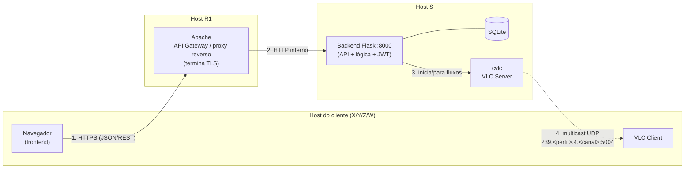
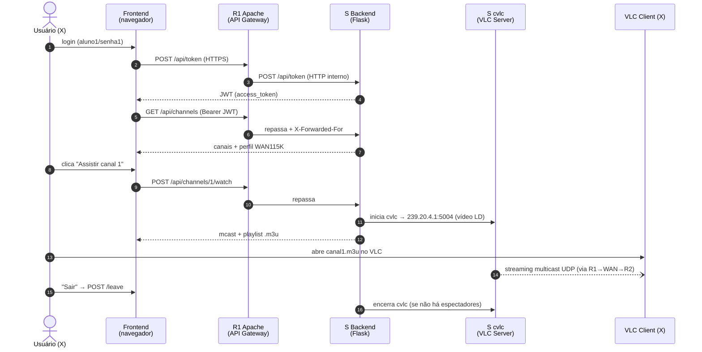
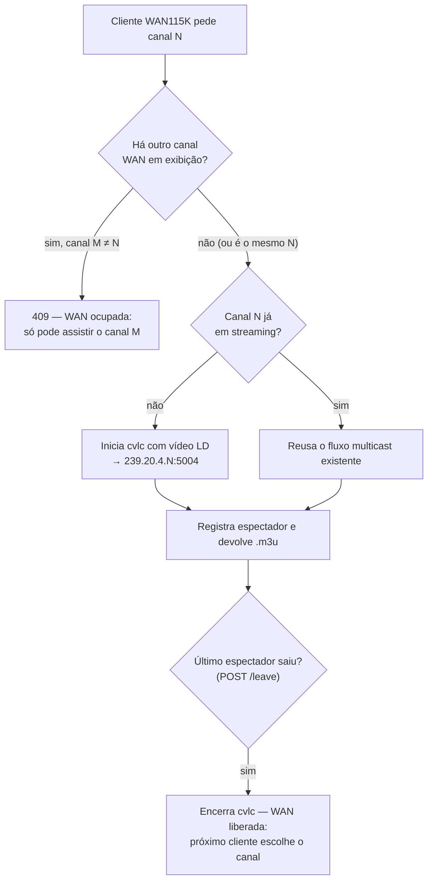

# Tutorial — Fase 2: Aplicação Mini-IPTV (Ubuntu 22.04, Grupo 4)

Pré-requisito: **Fase 1 funcionando** (rede, PPP, multicast, DNS, NAT, Apache em R1).

## Arquitetura



- Backend: **Python Flask + SQLite** em S (`/opt/miniiptv`), emite **JWT** via endpoint OAuth2 (password grant).
- Perfil detectado pelo IP do cliente: `192.168.0.x` → **WAN115K** (239.20.4.x, vídeo LD), resto → **LAN** (239.10.4.x, vídeo original).
- Regra WAN115K: **um canal por vez**; streaming inicia com o 1º espectador e para com o último.

> Blocos que dependem do PC começam com um `select` que lista as interfaces e pede o número (igual à Fase 1). Domínio `grupo4.unb`, grupo **4**, porta multicast **5004**.

## Índice por máquina

| Máquina | Passos em que ela roda comandos |
|---|---|
| **S** | 0 · 1 · 2 · 3 · 7 (conferências) |
| **R1** | 4 · 5 · 7 (ocupação da WAN) |
| **X / Y / Z / W** | 4 (validar) · 6 · 7 · 8 |

---

## 0. Pacotes — 📍 só em S

```bash
sudo apt update
sudo apt install -y python3-pip ffmpeg vlc-bin vlc-plugin-base sqlite3
sudo pip3 install flask pyjwt werkzeug
```

> `vlc-bin` traz o `cvlc` (VLC sem GUI). O VLC **não roda como root** — criaremos um usuário de serviço.

```bash
sudo useradd -r -m -d /opt/miniiptv iptv
sudo mkdir -p /opt/miniiptv/videos
sudo chown -R iptv:iptv /opt/miniiptv
```

Rota multicast de saída (os pacotes 239.x devem sair pela LAN#1):

```bash
# Escolha a interface da LAN#1 (digite o número):
select LAN1 in $(ls /sys/class/net | grep -vE '^(lo|ppp|docker|veth|br-)'); do break; done; echo "LAN1=$LAN1"

sudo ip route add 239.0.0.0/8 dev $LAN1
```

---

## 1. Preparar vídeos (ffmpeg / ffprobe) — 📍 só em S

Copie 3 vídeos `.mp4` para `/opt/miniiptv/videos/` (ex.: `filme.mp4`, `aula.mp4`, `show.mp4`).

```bash
cd /opt/miniiptv/videos

# Converter para versão de baixa qualidade (comando do enunciado, compatível com 115200 bps)
for v in filme aula show; do
  ffmpeg -i ${v}.mp4 -c:v libx264 -b:v 80k -r 10 -s 320x240 \
         -c:a aac -b:a 16k -ac 1 -ar 22050 ${v}_ld.mp4
done

# Ver metadados (usados no cadastro: duração, resolução, bitrate, codecs)
ffprobe -v quiet -show_format -show_streams filme.mp4 | grep -E 'duration|bit_rate|codec_name|width|height'
sudo chown iptv:iptv /opt/miniiptv/videos/*
```

---

## 2. Backend Flask — 📍 só em S

```bash
sudo tee /opt/miniiptv/app.py >/dev/null <<'EOF'
import os, json, sqlite3, subprocess, functools, datetime, jwt
from flask import Flask, request, jsonify, g
from werkzeug.security import generate_password_hash, check_password_hash
from werkzeug.utils import secure_filename

SECRET  = "grupo4-troque-este-segredo"
DB      = "/opt/miniiptv/iptv.db"
VIDEOS  = "/opt/miniiptv/videos"
GRUPO   = 4
PORTA_M = 5004
app = Flask(__name__)

# canal -> {"proc": Popen, "profile": str, "addr": str}
streams = {}
# (canal, profile) -> set(usuarios)
viewers = {}

def db():
    c = sqlite3.connect(DB); c.row_factory = sqlite3.Row; return c

def perfil():
    ip = request.headers.get("X-Forwarded-For", request.remote_addr).split(",")[0].strip()
    return "WAN115K" if ip.startswith("192.168.0.") else "LAN"

def mcast(canal, prof):
    return f"239.{20 if prof=='WAN115K' else 10}.{GRUPO}.{canal}"

def auth(admin=False):
    def deco(f):
        @functools.wraps(f)
        def w(*a, **kw):
            h = request.headers.get("Authorization", "")
            if not h.startswith("Bearer "):
                return jsonify(error="token ausente"), 401
            try:
                t = jwt.decode(h[7:], SECRET, algorithms=["HS256"])
            except jwt.PyJWTError as e:
                return jsonify(error=f"token invalido: {e}"), 401
            if admin and t["role"] != "admin":
                return jsonify(error="apenas admin"), 403
            g.user, g.role = t["sub"], t["role"]
            return f(*a, **kw)
        return w
    return deco

# ---------- OAuth2 (password grant) -> JWT ----------
@app.post("/api/token")
def token():
    d = request.form if request.form else (request.json or {})
    u = db().execute("SELECT * FROM users WHERE username=?", (d.get("username"),)).fetchone()
    if not u or not check_password_hash(u["pw"], d.get("password", "")):
        return jsonify(error="invalid_grant"), 401
    tok = jwt.encode({"sub": u["username"], "role": u["role"],
                      "exp": datetime.datetime.utcnow() + datetime.timedelta(hours=4)},
                     SECRET, algorithm="HS256")
    return jsonify(access_token=tok, token_type="Bearer", expires_in=14400)

# ---------- Canais ----------
@app.get("/api/channels")
@auth()
def channels():
    prof, out = perfil(), []
    for c in db().execute("SELECT * FROM channels ORDER BY num"):
        v = db().execute("SELECT * FROM videos WHERE channel=?", (c["num"],)).fetchone()
        ativo = c["num"] in streams
        out.append({"num": c["num"], "nome": c["nome"], "descricao": c["desc"],
                    "video": dict(v) if v else None,
                    "status": "ativo" if ativo else ("disponivel" if v else "indisponivel"),
                    "espectadores": sum(len(s) for (n, p), s in viewers.items() if n == c["num"]),
                    "mcast": mcast(c["num"], prof)})
    return jsonify(perfil=prof, canais=out)

@app.post("/api/channels")
@auth(admin=True)
def add_channel():
    d = request.json
    db().execute("INSERT INTO channels(num,nome,desc) VALUES(?,?,?)",
                 (d["num"], d["nome"], d.get("desc", ""))).connection.commit()
    return jsonify(ok=True), 201

@app.delete("/api/channels/<int:n>")
@auth(admin=True)
def del_channel(n):
    db().execute("DELETE FROM channels WHERE num=?", (n,)).connection.commit()
    return jsonify(ok=True)

# ---------- Vídeos (upload + conversão LD + metadados) ----------
@app.post("/api/videos")
@auth(admin=True)
def add_video():
    f = request.files["file"]; canal = int(request.form["channel"])
    nome = secure_filename(f.filename); orig = os.path.join(VIDEOS, nome)
    f.save(orig)
    ld = orig.rsplit(".", 1)[0] + "_ld.mp4"
    subprocess.run(["ffmpeg", "-y", "-i", orig, "-c:v", "libx264", "-b:v", "80k",
                    "-r", "10", "-s", "320x240", "-c:a", "aac", "-b:a", "16k",
                    "-ac", "1", "-ar", "22050", ld], check=True, capture_output=True)
    p = subprocess.run(["ffprobe", "-v", "quiet", "-print_format", "json",
                        "-show_format", "-show_streams", orig], capture_output=True, text=True)
    meta = json.loads(p.stdout)
    db().execute("INSERT OR REPLACE INTO videos(channel,arq_hd,arq_ld,meta) VALUES(?,?,?,?)",
                 (canal, orig, ld, json.dumps(meta["format"]))).connection.commit()
    return jsonify(ok=True, metadados=meta["format"]), 201

# ---------- Assistir / trocar / sair ----------
def start_stream(canal, prof):
    v = db().execute("SELECT * FROM videos WHERE channel=?", (canal,)).fetchone()
    if not v: return None
    arq = v["arq_ld"] if prof == "WAN115K" else v["arq_hd"]
    addr = mcast(canal, prof)
    proc = subprocess.Popen(["cvlc", "-I", "dummy", arq, "--loop", "--ttl", "16",
                             "--sout", f"#udp{{mux=ts,dst={addr}:{PORTA_M}}}"],
                            stdout=subprocess.DEVNULL, stderr=subprocess.DEVNULL)
    streams[canal] = {"proc": proc, "profile": prof, "addr": addr}
    return addr

def stop_if_empty(canal, prof):
    if not viewers.get((canal, prof)) and canal in streams and streams[canal]["profile"] == prof:
        streams[canal]["proc"].terminate()
        del streams[canal]

@app.post("/api/channels/<int:n>/watch")
@auth()
def watch(n):
    prof = perfil()
    if prof == "WAN115K":
        outro = next((c for c, s in streams.items() if s["profile"] == "WAN115K" and c != n), None)
        if outro:
            return jsonify(error=f"WAN ocupada: canal {outro} em exibicao; assista-o ou aguarde",
                           canal_ativo=outro), 409
    # sai de outros canais (troca de canal)
    for k in list(viewers):
        if g.user in viewers[k] and k != (n, prof):
            viewers[k].discard(g.user); stop_if_empty(*k)
    if n not in streams:
        if not start_stream(n, prof):
            return jsonify(error="canal sem video"), 404
    viewers.setdefault((n, prof), set()).add(g.user)
    addr = streams[n]["addr"]
    m3u = f"#EXTM3U\n#EXTINF:-1,Canal {n}\nudp://@{addr}:{PORTA_M}\n"
    return jsonify(canal=n, perfil=prof, mcast=f"udp://@{addr}:{PORTA_M}", playlist=m3u)

@app.post("/api/channels/<int:n>/leave")
@auth()
def leave(n):
    prof = perfil()
    viewers.get((n, prof), set()).discard(g.user)
    stop_if_empty(n, prof)
    return jsonify(ok=True)

# ---------- Playlist m3u do perfil ----------
@app.get("/api/playlist.m3u")
@auth()
def playlist():
    prof, linhas = perfil(), ["#EXTM3U"]
    for c in db().execute("SELECT * FROM channels ORDER BY num"):
        linhas += [f"#EXTINF:-1,{c['nome']}", f"udp://@{mcast(c['num'], prof)}:{PORTA_M}"]
    return "\n".join(linhas) + "\n", 200, {"Content-Type": "audio/x-mpegurl"}

# ---------- Admin: visão geral ----------
@app.get("/api/admin/status")
@auth(admin=True)
def status():
    vlc = subprocess.run(["pgrep", "-a", "vlc"], capture_output=True, text=True).stdout
    return jsonify(
        usuarios_conectados={f"canal{n}/{p}": sorted(s) for (n, p), s in viewers.items() if s},
        canais_ativos={n: {"perfil": s["profile"], "mcast": s["addr"]} for n, s in streams.items()},
        processos_vlc=vlc.strip().splitlines())

if __name__ == "__main__":
    app.run(host="0.0.0.0", port=8000)
EOF
```

Banco de dados + usuários iniciais:

```bash
sudo tee /opt/miniiptv/initdb.py >/dev/null <<'EOF'
import sqlite3
from werkzeug.security import generate_password_hash
c = sqlite3.connect("/opt/miniiptv/iptv.db")
c.executescript("""
CREATE TABLE IF NOT EXISTS users(username TEXT PRIMARY KEY, pw TEXT, role TEXT);
CREATE TABLE IF NOT EXISTS channels(num INTEGER PRIMARY KEY, nome TEXT, desc TEXT);
CREATE TABLE IF NOT EXISTS videos(channel INTEGER PRIMARY KEY, arq_hd TEXT, arq_ld TEXT, meta TEXT);
""")
for u, p, r in [("admin", "admin123", "admin"), ("aluno1", "senha1", "user"), ("aluno2", "senha2", "user")]:
    c.execute("INSERT OR REPLACE INTO users VALUES(?,?,?)", (u, generate_password_hash(p), r))
# canais iniciais + vínculo com os vídeos do passo 1
canais = [(1, "Filme", "Canal de filmes", "filme"), (2, "Aula", "Canal de aulas", "aula"), (3, "Show", "Canal de shows", "show")]
for n, nome, d, arq in canais:
    c.execute("INSERT OR REPLACE INTO channels VALUES(?,?,?)", (n, nome, d))
    c.execute("INSERT OR REPLACE INTO videos VALUES(?,?,?,?)",
              (n, f"/opt/miniiptv/videos/{arq}.mp4", f"/opt/miniiptv/videos/{arq}_ld.mp4", "{}"))
c.commit()
print("ok")
EOF
sudo -u iptv python3 /opt/miniiptv/initdb.py
sudo chown -R iptv:iptv /opt/miniiptv
```

Serviço systemd:

```bash
sudo tee /etc/systemd/system/miniiptv.service >/dev/null <<'EOF'
[Unit]
Description=Backend Mini-IPTV
After=network.target
[Service]
User=iptv
WorkingDirectory=/opt/miniiptv
ExecStart=/usr/bin/python3 /opt/miniiptv/app.py
Restart=always
[Install]
WantedBy=multi-user.target
EOF
sudo systemctl daemon-reload
sudo systemctl enable --now miniiptv
systemctl is-active miniiptv     # active
```

---

## 3. Testar a API antes do gateway — 📍 em S

### 📍 Em S
```bash
# Obter token JWT (OAuth2 password grant)
TOK=$(curl -s -X POST http://localhost:8000/api/token \
      -d username=aluno1 -d password=senha1 | python3 -c 'import sys,json;print(json.load(sys.stdin)["access_token"])')
echo $TOK

# Listar canais
curl -s -H "Authorization: Bearer $TOK" http://localhost:8000/api/channels | python3 -m json.tool

# Sem token deve dar 401
curl -s http://localhost:8000/api/channels
```

---

## 4. API Gateway com HTTPS — 📍 só em R1 (validação em X)

O frontend fala **HTTPS com R1**; R1 repassa em **HTTP interno** para S (como na Figura 2 do enunciado).

### 📍 Em R1
```bash
# certificado autoassinado + vhost SSL
sudo a2enmod ssl proxy proxy_http headers
sudo openssl req -new -x509 -days 365 -nodes -subj "/CN=r1.grupo4.unb" \
  -out /etc/ssl/certs/r1.pem -keyout /etc/ssl/private/r1.key

sudo tee /etc/apache2/sites-available/miniiptv-ssl.conf >/dev/null <<'EOF'
<VirtualHost *:443>
    ServerName r1.grupo4.unb
    SSLEngine on
    SSLCertificateFile /etc/ssl/certs/r1.pem
    SSLCertificateKeyFile /etc/ssl/private/r1.key
    DocumentRoot /var/www/html
    ProxyPreserveHost On
    # repassa o IP real do cliente para o backend decidir o perfil
    RemoteIPHeader X-Forwarded-For
    ProxyPass        /api http://172.16.0.2:8000/api
    ProxyPassReverse /api http://172.16.0.2:8000/api
</VirtualHost>
EOF
sudo a2ensite miniiptv-ssl
sudo systemctl reload apache2
```

**Validar:**

### 📍 Em X
```bash
curl -sk https://r1.grupo4.unb/api/token -d username=aluno1 -d password=senha1
```
> `-k` aceita o certificado autoassinado.

---

## 5. Frontend (página estática) — 📍 só em R1

### 📍 Em R1
```bash
sudo tee /var/www/html/iptv.html >/dev/null <<'EOF'
<!doctype html><meta charset="utf-8"><title>Mini-IPTV Grupo 4</title>
<style>body{font-family:sans-serif;max-width:720px;margin:2em auto}li{margin:.6em 0}
button{margin-left:.5em}#log{color:#06c}</style>
<h1>Mini-IPTV — Grupo 4</h1>
<div id="login"><input id="u" placeholder="usuário"> <input id="p" type="password" placeholder="senha">
<button onclick="entrar()">Entrar</button></div>
<p id="log"></p><ul id="canais"></ul>
<script>
let tok=null;
const api=(p,opt={})=>fetch("/api"+p,{...opt,headers:{...opt.headers,
  ...(tok?{"Authorization":"Bearer "+tok}:{})}}).then(r=>r.json().then(j=>({s:r.status,j})));
async function entrar(){
  const b=new URLSearchParams({username:u.value,password:p.value});
  const {s,j}=await api("/token",{method:"POST",body:b});
  if(s!=200){log.textContent="login falhou";return}
  tok=j.access_token; login.style.display="none"; listar();
}
async function listar(){
  const {j}=await api("/channels");
  log.textContent="perfil: "+j.perfil;
  canais.innerHTML=j.canais.map(c=>`<li><b>Canal ${c.num} — ${c.nome}</b> (${c.status},
   ${c.espectadores} assistindo) ${c.descricao||""}
   <button onclick="assistir(${c.num})">Assistir</button>
   <button onclick="sair(${c.num})">Sair</button></li>`).join("");
}
async function assistir(n){
  const {s,j}=await api(`/channels/${n}/watch`,{method:"POST"});
  if(s!=200){log.textContent=j.error;return}
  log.textContent=`Canal ${n}: abra no VLC -> ${j.mcast}`;
  const b=new Blob([j.playlist],{type:"audio/x-mpegurl"});
  const a=document.createElement("a");a.href=URL.createObjectURL(b);
  a.download=`canal${n}.m3u`;a.click(); listar();
}
async function sair(n){await api(`/channels/${n}/leave`,{method:"POST"});listar()}
setInterval(()=>tok&&listar(),5000);
</script>
EOF
```

---

## 6. Fluxo do cliente — 📍 em X, Y (perfil WAN115K) e Z, W (perfil LAN)



1. Navegador → `https://r1.grupo4.unb/iptv.html` (aceite o certificado).
2. Login `aluno1 / senha1` → lista de canais mostra **perfil detectado** (WAN115K em X/Y, LAN em Z/W).
3. **Assistir** → baixa `canalN.m3u` → abra no VLC (`vlc canalN.m3u` ou duplo clique).
4. Ou direto no VLC: *Mídia → Abrir fluxo de rede* → `udp://@239.20.4.1:5004`.
5. **Sair** ao terminar (libera a WAN para outro canal).

---

## 7. Validar as regras de negócio — 📍 clientes X/Y/Z/W · conferências em S e R1

**Decisão do backend ao receber `watch` de um cliente WAN115K:**



### 📍 Em X e Y (navegador — regra WAN115K: um canal por vez)
1. **Em X:** assistir canal 1 → ok (recebe `239.20.4.1`, versão LD).
2. **Em Y:** assistir canal 2 → deve receber **erro 409** "WAN ocupada: canal 1".
3. **Em Y:** assistir canal 1 → ok (mesmo fluxo multicast que X).
4. X e Y saem do canal 1 → streaming para; agora Y pode escolher o canal 2.

### 📍 Em Z e W (navegador — regra LAN: canais simultâneos, qualidade original)
- **Em Z:** assistir canal 1 (`239.10.4.1`, HD) e, ao mesmo tempo, **em W:** canal 2 (`239.10.4.2`, HD) → ambos funcionam.

### 📍 Em S (streaming inicia/para conforme o interesse)
```bash
pgrep -a vlc     # antes de alguém assistir: vazio
                 # após "Assistir": aparece cvlc ... dst=239.20.4.1
                 # após todos saírem: o processo some
```

### 📍 Em qualquer máquina (visão do admin)
```bash
TOK=$(curl -sk https://r1.grupo4.unb/api/token -d username=admin -d password=admin123 | python3 -c 'import sys,json;print(json.load(sys.stdin)["access_token"])')
curl -sk -H "Authorization: Bearer $TOK" https://r1.grupo4.unb/api/admin/status | python3 -m json.tool
```

### 📍 Em R1 (ocupação da WAN e fluxos multicast ativos)
```bash
tc -s qdisc show dev ppp0
sudo smcroutectl show
```

### 📍 Em qualquer máquina (upload de vídeo novo, como admin)
```bash
curl -sk -H "Authorization: Bearer $TOK" \
  -F "file=@novo_video.mp4" -F "channel=3" https://r1.grupo4.unb/api/videos
# resposta traz os metadados (duração, bitrate) extraídos pelo ffprobe
```

---

## 8. Bateria final — 📍 X e Z (clientes) · R1/R2 (contadores)

### 📍 Em X (perfil WAN115K)
```bash
curl -sk https://r1.grupo4.unb/api/token -d username=aluno1 -d password=senha1   # token OK
```
Frontend lista canais com perfil **WAN115K**; VLC reproduz `239.20.4.1:5004` (vídeo LD).

### 📍 Em Z (perfil LAN)
VLC reproduz `239.10.4.1:5004` (vídeo HD) enquanto W assiste outro canal.

### 📍 Em R1 e em R2
```bash
sudo smcroutectl show      # contadores dos grupos crescendo
```

Tudo ok → Fase 2 concluída. Evidências para o vídeo/relatório: tela do frontend com perfil, VLC reproduzindo nos dois perfis, o 409 da regra WAN, `pgrep vlc` antes/depois, `smcroutectl show`, saída do `/api/admin/status`.

---

## Problemas comuns

| Sintoma | Causa provável | Correção |
|---|---|---|
| VLC não reproduz nada | multicast não chega (Fase 1) ou TTL baixo | teste `iperf` do tutorial 1; `--ttl 16` já está no cvlc |
| cvlc morre na hora | rodando como root ou arquivo inexistente | serviço roda como `iptv`; confira caminho do vídeo |
| vídeo trava/quadriculado na WAN | bitrate acima de 115 kbps | reconverta com `-b:v 80k` (passo 1); confira `tc` |
| 401 em tudo | token ausente/expirado | refaça `/api/token`; validade 4 h |
| perfil errado (X aparece como LAN) | Apache não repassa o IP do cliente | vhost com `ProxyPreserveHost`/`X-Forwarded-For` (passo 4) |
| 502 no gateway | backend parado | `systemctl status miniiptv`; `journalctl -u miniiptv -e` |
| upload falha | pasta sem permissão | `chown -R iptv:iptv /opt/miniiptv` |
| multicast sai pela interface errada em S | falta rota 239/8 | `ip route add 239.0.0.0/8 dev LAN1` |
