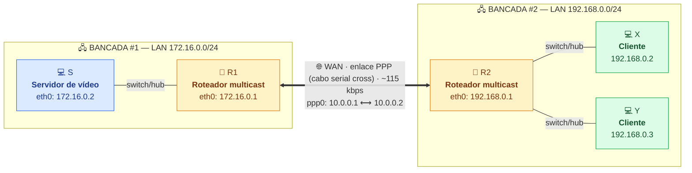
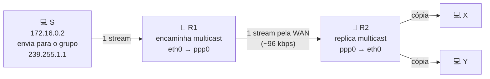

# Guia completo — Servidor de vídeo em rede multicast (PPP + multicast)

Este guia cobre o projeto inteiro, máquina por máquina, com **todos os comandos**.
Topologia usada: **Figura 01** (com enlace WAN via PPP entre dois roteadores).

> ⚠️ Quase todos os comandos precisam de **root**. Use `sudo` ou entre como root com `sudo -i`.

---

## 📦 O que instalar em cada máquina (faça isto primeiro)

Comandos para **Debian/Ubuntu** (`apt`). Em distros com outro gerenciador, troque `apt-get install` por `dnf install` (Fedora/RHEL) ou `pacman -S` (Arch).

> Antes de tudo, em **todas** as máquinas:
> ```bash
> sudo apt-get update
> ```

| Máquina | Pacotes necessários | Para quê |
|---------|---------------------|----------|
| **S** (servidor) | `vlc` | transmitir o vídeo em multicast |
| **R1** (roteador) | `ppp`, `smcroute`, `iproute2`, `tcpdump`, `iftop` | enlace PPP, roteamento multicast, diagnóstico |
| **R2** (roteador) | `ppp`, `smcroute`, `iproute2`, `tcpdump`, `iftop` | enlace PPP, roteamento multicast, diagnóstico |
| **X** (cliente) | `vlc` | receber/assistir o vídeo |
| **Y** (cliente) | `vlc` | receber/assistir o vídeo |

> `iproute2` (que fornece o comando `ip` e o `tc`) quase sempre **já vem instalado**. Os demais talvez precisem ser instalados.

### Comando único por papel

**No servidor S:**
```bash
sudo apt-get install -y vlc
```

**Em CADA roteador (R1 e R2):**
```bash
sudo apt-get install -y ppp smcroute iproute2 tcpdump iftop
```

**Em CADA cliente (X e Y):**
```bash
sudo apt-get install -y vlc
```

> ℹ️ O VLC se recusa a rodar como `root`. Rode-o com seu **usuário normal** (sem `sudo`). Os comandos de rede (`ip`, `pppd`, `smcroute`, `tc`) é que precisam de `sudo`.

> ℹ️ Você também precisa de um **arquivo de vídeo** na máquina S para transmitir (ex.: `video.mp4`). Qualquer vídeo serve para o teste.

---

## 0. Visão geral da topologia e máquinas

São necessárias **5 máquinas Linux**.

### Topologia física



### Caminho do fluxo de vídeo (multicast)

Um **único** stream de ~96 kbps sai do servidor, atravessa a WAN uma só vez, e é **replicado** por R2 para os dois clientes — esse é o objetivo do projeto.



| Máquina | Papel                | Interface LAN (eth) | Interface WAN (ppp0) | Gateway padrão |
| ------- | -------------------- | ------------------- | -------------------- | -------------- |
| S       | Servidor de vídeo    | 172.16.0.2/24       | —                    | 172.16.0.1     |
| R1      | Roteador multicast 1 | 172.16.0.1/24       | 10.0.0.1             | —              |
| R2      | Roteador multicast 2 | 192.168.0.1/24      | 10.0.0.2             | —              |
| X       | Cliente de vídeo     | 192.168.0.2/24      | —                    | 192.168.0.1    |
| Y       | Cliente de vídeo     | 192.168.0.3/24      | —                    | 192.168.0.1    |

> **Descubra o nome real da sua placa de rede** antes de começar. Pode ser `eth0`, `enp3s0`, `ens33`, etc.:
>
> ```bash
> ip link show
> ```
>
> Nos comandos abaixo, **substitua `eth0` pelo nome real** da sua interface Ethernet.

**Ordem de montagem recomendada** (a mais difícil por último):

1. Endereçamento IP de todas as máquinas (Seção 1)
2. Enlace WAN via PPP entre R1 e R2 (Seção 2)
3. Roteamento IP unicast e teste fim-a-fim (Seção 3)
4. Servidor de vídeo em S (Seção 4)
5. Roteamento multicast em R1 e R2 (Seção 5)
6. Testes com e sem multicast (Seção 6)

---

## 1. Endereçamento IP (todas as máquinas)

Os comandos `ip` abaixo são **temporários** (perdem-se ao reiniciar) — perfeitos para o laboratório. No fim da seção há uma observação sobre como tornar permanente.

### 1.1. Servidor S

```bash
sudo ip addr flush dev eth0
sudo ip addr add 172.16.0.2/24 dev eth0
sudo ip link set eth0 up
sudo ip route add default via 172.16.0.1
```

### 1.2. Roteador R1

Lado LAN (Ethernet). A parte do `ppp0` é feita na Seção 2.

```bash
sudo ip addr flush dev eth0
sudo ip addr add 172.16.0.1/24 dev eth0
sudo ip link set eth0 up
```

### 1.3. Roteador R2

```bash
sudo ip addr flush dev eth0
sudo ip addr add 192.168.0.1/24 dev eth0
sudo ip link set eth0 up
```

### 1.4. Cliente X

```bash
sudo ip addr flush dev eth0
sudo ip addr add 192.168.0.2/24 dev eth0
sudo ip link set eth0 up
sudo ip route add default via 192.168.0.1
```

### 1.5. Cliente Y

```bash
sudo ip addr flush dev eth0
sudo ip addr add 192.168.0.3/24 dev eth0
sudo ip link set eth0 up
sudo ip route add default via 192.168.0.1
```

### 1.6. Verificação

Em cada máquina:

```bash
ip addr show eth0      # confere o IP
ip route               # confere as rotas
```

Teste o "primeiro salto" dentro de cada LAN:

```bash
# Em S:
ping -c 3 172.16.0.1   # alcança R1?
# Em X:
ping -c 3 192.168.0.1  # alcança R2?
```

> **Para tornar permanente** (opcional): em distros com `netplan` (Ubuntu) edite `/etc/netplan/*.yaml`; com `NetworkManager` use `nmcli`; com `ifupdown` edite `/etc/network/interfaces`. Para o laboratório, os comandos `ip` acima bastam.

---

## 2. Enlace WAN via PPP (R1 e R2)

O PPP cria a interface virtual `ppp0` sobre o cabo serial cross, formando o "link de WAN".

### 2.1. Pré-requisitos

Em R1 e R2, garanta que o `pppd` está instalado:

```bash
which pppd || sudo apt-get install -y ppp     # Debian/Ubuntu
```

Cabo serial **cross (null-modem)** conectado na porta **COM1** das duas máquinas.
Descubra o nome do dispositivo serial:

```bash
ls -l /dev/ttyS*        # portas seriais físicas (COM1 normalmente = /dev/ttyS0)
dmesg | grep -i tty     # confirma qual porta existe
```

Normalmente **COM1 = `/dev/ttyS0`**. Ajuste se for outra.

### 2.2. Opção A — usando `/etc/ppp/options` (como sugere o roteiro)

Edite o arquivo nas duas máquinas:

```bash
sudo nano /etc/ppp/options
```

O conteúdo deve ser **igual** nas duas, exceto a linha de IPs (`IP_local:IP_remoto`):

Em **R1**, inclua a linha:

```
10.0.0.1:10.0.0.2
```

Em **R2**, inclua a linha:

```
10.0.0.2:10.0.0.1
```

Garanta também que existam estas linhas (essenciais para link de laboratório, sem autenticação):

```
noauth
lock
local
```

Depois, suba o PPP em **R1 e R2 ao mesmo tempo**:

```bash
sudo /usr/sbin/pppd /dev/ttyS0 115200
```

### 2.3. Opção B — tudo na linha de comando (mais robusto p/ depurar)

Se preferir não mexer no arquivo, passe tudo direto. Execute **simultaneamente**:

Em **R1**:

```bash
sudo pppd /dev/ttyS0 115200 10.0.0.1:10.0.0.2 noauth local lock nodetach debug
```

Em **R2**:

```bash
sudo pppd /dev/ttyS0 115200 10.0.0.2:10.0.0.1 noauth local lock nodetach debug
```

- `115200` = velocidade da serial em baud (≈115 kbps, que é a taxa de WAN pedida no item d).
- `nodetach debug` = mantém em primeiro plano mostrando a negociação (bom para ver erros). Tire depois.

### 2.4. Verificação

Em cada roteador:

```bash
ip addr show ppp0        # ou: ifconfig ppp0
```

Deve aparecer `ppp0` com `10.0.0.1` (R1) e `10.0.0.2` (R2). Teste o enlace:

```bash
# Em R1:
ping -c 3 10.0.0.2
# Em R2:
ping -c 3 10.0.0.1
```

### 2.5. Se o `pppd` não subir

```bash
ps aux | grep pppd          # descubra o PID
sudo kill -9 <PID>          # mate o processo travado
```

Depois repita 2.2/2.3. Causas comuns: cabo mal encaixado, dispositivo serial errado (`/dev/ttyS0` vs `/dev/ttyS1`), `pppd` não disparado ao mesmo tempo nas duas pontas, ou `options` divergente.

---

## 3. Roteamento IP unicast e teste fim-a-fim

### 3.1. Habilitar o encaminhamento de pacotes (IP forwarding) — em R1 e R2

Sem isso o Linux não roteia entre interfaces.

```bash
sudo sysctl -w net.ipv4.ip_forward=1
```

Confirme:

```bash
cat /proc/sys/net/ipv4/ip_forward   # deve mostrar 1
```

### 3.2. Rotas entre as LANs

Em **R1** (para alcançar a LAN da bancada #2):

```bash
sudo ip route add 192.168.0.0/24 via 10.0.0.2 dev ppp0
```

Em **R2** (para alcançar a LAN da bancada #1):

```bash
sudo ip route add 172.16.0.0/24 via 10.0.0.1 dev ppp0
```

(S, X e Y já têm o gateway padrão configurado na Seção 1.)

### 3.3. Teste fim-a-fim (unicast)

```bash
# De S (172.16.0.2) até um cliente:
ping -c 3 192.168.0.2     # alcança X?
ping -c 3 192.168.0.3     # alcança Y?

# De X até o servidor:
ping -c 3 172.16.0.2      # alcança S?
```

Se isso funcionar, a parte de WAN (PPP) + roteamento unicast está completa. **Só agora** avance para o multicast.

---

## 4. Servidor de vídeo (máquina S) — VLC

### 4.1. Instalar o VLC

```bash
sudo apt-get update
sudo apt-get install -y vlc
```

### 4.2. Transmitir um vídeo em multicast

Use um endereço **classe D** (multicast). Vamos usar `239.255.1.1` (faixa administrativa, recomendada) na porta `1234`.

> ⚠️ **CRÍTICO — TTL:** o TTL padrão de multicast é **1**, o que faz o pacote **morrer no primeiro roteador** e nunca cruzar a WAN. É **obrigatório** subir o TTL (ex.: `--ttl 16`). Esse é o erro nº 1 nesse projeto.

Transmissão simples (sem recodificar), com o vídeo limitado a ~96 kbps via transcode:

```bash
cvlc /caminho/do/video.mp4 \
  --sout '#transcode{vcodec=mp4v,vb=96,scale=auto,acodec=mpga,ab=16,channels=1}:standard{access=udp,mux=ts,dst=239.255.1.1:1234}' \
  --ttl 16 \
  --loop \
  --no-sout-all
```

- `vb=96` = bitrate de vídeo ≈ 96 kbps (taxa pedida pelo projeto).
- `dst=239.255.1.1:1234` = grupo multicast + porta.
- `--ttl 16` = permite cruzar os roteadores.
- `--loop` = repete o vídeo (útil para testes longos).
- `cvlc` = VLC sem interface gráfica (pode usar `vlc` normal também).

Se quiser transmitir sem recodificar (vídeo já em ~96 kbps):

```bash
cvlc /caminho/do/video.mp4 \
  --sout '#standard{access=udp,mux=ts,dst=239.255.1.1:1234}' \
  --ttl 16 --loop
```

### 4.3. Confirmar que os pacotes estão saindo

```bash
# em S, veja o tráfego para o grupo multicast:
sudo tcpdump -i eth0 host 239.255.1.1
```

---

## 5. Roteamento multicast (R1 e R2) — smcroute

Multicast estático é o caminho mais simples e confiável para este lab. O `smcroute` instala rotas multicast manuais (entrada → saída).

### 5.1. Preparar os roteadores

Em **R1 e R2**:

```bash
# instalar
sudo apt-get install -y smcroute

# habilitar forwarding multicast e desligar o reverse-path filter
# (o rp_filter costuma DERRUBAR multicast que chega pela WAN)
sudo sysctl -w net.ipv4.ip_forward=1
sudo sysctl -w net.ipv4.conf.all.rp_filter=0
sudo sysctl -w net.ipv4.conf.eth0.rp_filter=0
sudo sysctl -w net.ipv4.conf.ppp0.rp_filter=0
```

### 5.2. Regras de encaminhamento multicast

O fluxo é: **S (eth0 de R1) → ppp0 → ppp0 de R2 → eth0 de R2 → X e Y**.

Sintaxe (smcroute clássico): `smcroute -a <iface_entrada> <IP_origem> <grupo_mcast> <iface_saida>`

Em **R1** (recebe do servidor pela LAN, manda pela WAN):

```bash
sudo smcroute -a eth0 172.16.0.2 239.255.1.1 ppp0
```

Em **R2** (recebe pela WAN, manda para a LAN dos clientes):

```bash
sudo smcroute -a ppp0 172.16.0.2 239.255.1.1 eth0
```

> Se o seu `smcroute` for a versão 2.x (daemon + arquivo de configuração), use `/etc/smcroute.conf`:
>
> ```
> # /etc/smcroute.conf em R1
> mroute from eth0 group 239.255.1.1 source 172.16.0.2 to ppp0
> ```
>
> ```
> # /etc/smcroute.conf em R2
> mroute from ppp0 group 239.255.1.1 source 172.16.0.2 to eth0
> ```
>
> E inicie o daemon: `sudo smcrouted` (e recarregue com `sudo smcroutectl reload`).

### 5.3. Garantir que R2 "puxa" o grupo

Em alguns casos o R2 só encaminha o multicast se houver interesse (IGMP) dele. Force a junção ao grupo na interface de entrada:

```bash
# em R2:
sudo smcroute -j ppp0 239.255.1.1     # join no grupo pela WAN
```

---

## 6. Testes do multicast (clientes X e Y)

### 6.1. Instalar VLC nos clientes

```bash
sudo apt-get install -y vlc
```

### 6.2. Abrir o stream multicast

Em **X** e em **Y**:

```bash
vlc udp://@239.255.1.1:1234
```

> A `@` antes do endereço é o que diz ao VLC para **entrar no grupo multicast** (gera o IGMP join). Sem ela, não funciona.

Linha de comando equivalente (sem GUI):

```bash
cvlc udp://@239.255.1.1:1234
```

### 6.3. O experimento que comprova o sucesso

A taxa de WAN (serial PPP) é ~115 kbps; cada stream tem ~96 kbps.

1. **Sem multicast / dois fluxos unicast:** se você fizesse o servidor enviar **um stream por cliente**, dois streams (≈192 kbps) **estouram** o link de 115 kbps → vídeo com falhas nos dois clientes.
2. **Com multicast (esta montagem):** apenas **um único** stream de ~96 kbps cruza a WAN, e R2 o **replica** para X e Y na LAN local. Os dois assistem com qualidade. **Isso é a prova do objetivo do projeto.**

Para evidenciar, observe o tráfego no link WAN com 1 e com 2 clientes — ele permanece em ~96 kbps mesmo com 2 clientes:

```bash
# em R1 ou R2, contando o tráfego no ppp0:
sudo tcpdump -i ppp0 host 239.255.1.1
# ou para medir taxa em tempo real:
sudo apt-get install -y iftop && sudo iftop -i ppp0
```

### 6.4. (Opcional) Limitar a banda da WAN explicitamente com `tc`

A serial a 115200 baud já limita o link. Mas se quiser forçar/demonstrar o limite (ou se usar a topologia alternativa do Apêndice com Ethernet no lugar do PPP), use o **traffic control**:

```bash
# limita a interface a ~115 kbps:
sudo tc qdisc add dev ppp0 root tbf rate 115kbit latency 50ms burst 1540

# conferir:
tc qdisc show dev ppp0

# remover depois:
sudo tc qdisc del dev ppp0 root
```

---

## 7. Diagnóstico rápido (o que checar quando "não passa vídeo")

| Sintoma                      | Verifique                                                              |
| ---------------------------- | ---------------------------------------------------------------------- |
| Ping não passa entre LANs    | `ip_forward=1` nos dois roteadores? rotas da Seção 3.2?                |
| Ping ok, mas vídeo não chega | **TTL do VLC** (`--ttl 16`)? sem isso o multicast morre no 1º roteador |
| Vídeo não cruza a WAN        | regras `smcroute` (Seção 5.2)? `rp_filter=0`?                          |
| Cliente não recebe           | abriu com `udp://@...` (com `@`)? `smcroute -j` no R2?                 |
| `pppd` não sobe              | dispositivo serial certo? disparado nas 2 pontas juntas? cabo cross?   |
| Tabela multicast             | veja as rotas instaladas: `ip mroute show`                             |

Comandos úteis de inspeção:

```bash
ip mroute show                 # rotas multicast ativas no kernel
ip maddr show                  # grupos multicast nas interfaces
sudo tcpdump -i <iface> -n igmp   # vê os joins/leaves IGMP
cat /proc/net/igmp             # grupos por interface
```

---

## 8. Checklist final

- [ ] IPs configurados em S, R1, R2, X, Y (Seção 1)
- [ ] `ppp0` ativo entre R1 e R2, ping `10.0.0.1`↔`10.0.0.2` ok (Seção 2)
- [ ] `ip_forward=1` em R1 e R2 + rotas entre LANs (Seção 3)
- [ ] `ping` fim-a-fim entre S e X/Y ok (Seção 3.3)
- [ ] VLC transmitindo em `239.255.1.1:1234` **com `--ttl 16`** (Seção 4)
- [ ] `rp_filter=0` + regras `smcroute` em R1 e R2 (Seção 5)
- [ ] X e Y recebendo o vídeo com `udp://@239.255.1.1:1234` (Seção 6)
- [ ] Demonstrado: 1 só stream de ~96 kbps no link WAN servindo os 2 clientes (Seção 6.3)
